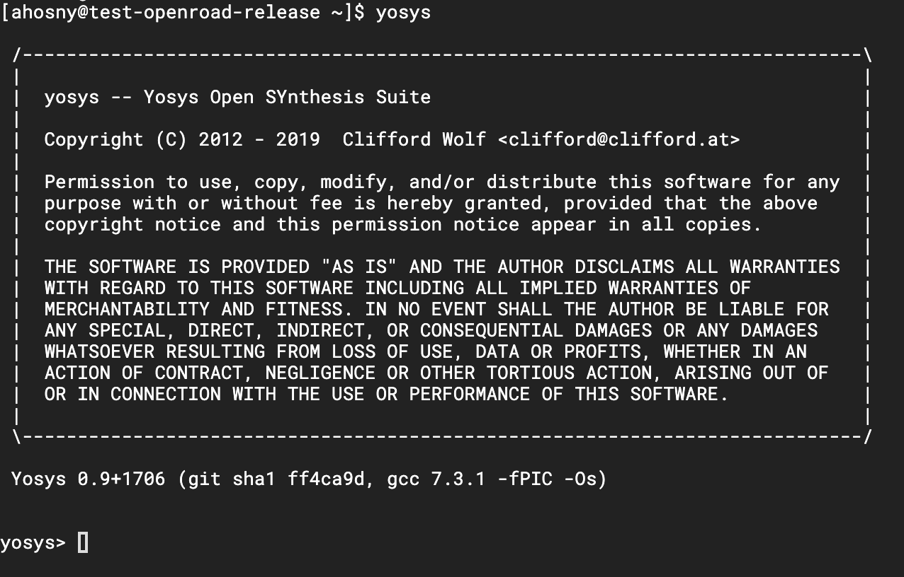
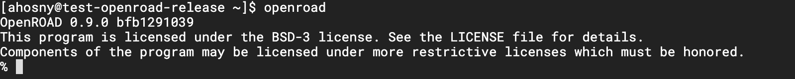

# Let's Verify Your Installation

After [preparing your environment](https://github.com/The-OpenROAD-Project/DAC-2020-Tutorial#prepare-your-environment), we want to make sure that all tools are installed correctly. So, let's verify your installation.

## Test Yosys

In the terminal, type `yosys`. You should be able to see the banner as below.

If you can't see this message, the *Logic Synthesis* step will fail. Please, go back to the [Prepare Your Environment Section](https://github.com/The-OpenROAD-Project/DAC-2020-Tutorial#prepare-your-environment).

## Test OpenROAD

In the terminal, type `openroad`. You should be able to see OpenROAD banner as below.

If you can't see this message, the *Floorplanning* to *Global Routing* steps will fail. Please, go back to the [Prepare Your Environment Section](https://github.com/The-OpenROAD-Project/DAC-2020-Tutorial#prepare-your-environment).

## Test TritonRoute

In the terminal, type `TritonRoute`. You should be able to see a message for the required parameters as below.

If you can't see this message, the *Detailed Routing* step will fail. Please, go back to the [Prepare Your Environment Section](https://github.com/The-OpenROAD-Project/DAC-2020-Tutorial#prepare-your-environment).

## Test KLayout

In the terminal, type `klayout -zz -v`. You should be able to see KLayout version printed as below.

If you can't see this message, the *Floorplanning* to *Global Routing* steps will fail. Please, go back to the [Prepare Your Environment Section](https://github.com/The-OpenROAD-Project/DAC-2020-Tutorial#prepare-your-environment).

## Test Autonomous Flow

Now, in order to test that you can run OpenROAD flow with no human in loop, do the following.

1. `git clone https://github.com/The-OpenROAD-Project/OpenROAD-flow.git`
2. `cd flow`
3. `make`

The above should run a default flow of **GCD** on **Nangate45**. If you see any errors, please go back to the [Prepare Your Environment Section](https://github.com/The-OpenROAD-Project/DAC-2020-Tutorial#prepare-your-environment).

[Next: Database access, features and tools &nbsp; :arrow_forward:](../2_database_access)