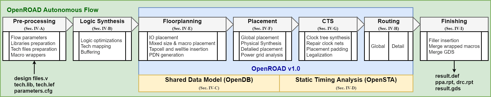

[:arrow_backward: Previous: Verify Installation](../1_verify_installation) &nbsp;&nbsp;&nbsp;&nbsp;|&nbsp;&nbsp;&nbsp;&nbsp;        [Next: Autonomous Flow :arrow_forward:](../3_rtl_to_gds_autonomous_flow)

# Database Access, Features and Tools

In this part, we are going to get a deep dive into OpenROAD flow and the different pieces that builds it up. We will also see different examples of accessing the database (the underlying data model of OpenROAD).

## Overview



**Repository:** https://github.com/The-OpenROAD-Project/OpenROAD-flow

**Autonomous Flow** 

The flow starts with some preprocessing steps to configure the parameters, prepare the libraries and tech files, and to warp macros. After that, the logic synthesis step is executed where a design in RTL is passed and a mapped netlist is outputted. Then, the physical design steps are run which include Floorplanning, Placement, Clock Tree Synthesis and Routing. This is followed by a finishing step to generate the GDS file along with reports.

## Physical Design

The physical design steps are shown in the blue boxes. 
All the steps are performed within `openroad` executable, except for the detailed routing step.

All tools use an underlying data model called [OpenDB](https://github.com/The-OpenROAD-Project/OpenDB). This database can be accessed directly from the `openroad` binary using `Tcl` commands. In addition, all tools use the [OpenSTA](https://github.com/The-OpenROAD-Project/OpenSTA) timing engine, which can also be instructed from `Tcl`.


## Hands-on

Now, open the terminal and let's see how to use these functionalities.

### Clone this repository

Start by cloning this repository to have access to all the data in one place.
```shell
git clone https://github.com/abdelrahmanhosny/DAC-2020-OpenROAD-Tutorial.git
cd DAC-2020-OpenROAD-Tutorial
```

### Load LEF/DEF

##### Change directory to this tutorial

```shell
cd 2_database_access
```

##### Run OpenROAD interactive Tcl shell

```shell
$ openroad
| OpenROAD 0.9.0 bfb1291039
| This program is licensed under the BSD-3 license. See the LICENSE file for details. 
| Components of the program may be licensed under more restrictive licenses which must be
| honored.
%
```
You will be welcomed with OpenROAD banner.

##### Create a database

```Tcl
set db [odb::dbDatabase_create]
```

You will see the following output which shows that a pointer to the newly created database.

```Tcl
% set db [odb::dbDatabase_create]
_60c71ce9ff7f0000_p_odb__dbDatabase
```

##### Read LEF file

```Tcl
set lib [odb::read_lef $db "data/gscl45nm.lef"]
```

You will see the following output which shows that OpenDB has successfully parsed the LEF file, creating 22 technology layers, 14 vias and 33 library cells.

```Tcl
% set lib [odb::read_lef $db "data/gscl45nm.lef"]
Notice 0: Reading LEF file:  data/gscl45nm.lef
Notice 0:     Created 22 technology layers
Notice 0:     Created 14 technology vias
Notice 0:     Created 33 library cells
Notice 0: Finished LEF file:  data/gscl45nm.lef
_60ca52e9ff7f0000_p_odb__dbLib
```

##### Read DEF file

```Tcl
set chip [odb::read_def $db "data/design.def"]
```

You will see the following output which shows that OpenDB has successfully parsed the DEF file, creating 12 pins, 12 components, 60 component-terminals, 24 nets, and 45 connections.

```Tcl
% set chip [odb::read_def $db "data/design.def"]
Notice 0:
Reading DEF file: data/design.def
Notice 0: Design: counter
Notice 0:     Created 12 pins.
Notice 0:     Created 12 components and 60 component-terminals.
Notice 0:     Created 24 nets and 45 connections.
Notice 0: Finished DEF file: data/design.def
_20421ad3ff7f0000_p_odb__dbChip
```

### Commands Help

You can see all available commands in the tool by using:

```Tcl
% help
```

**Exercise**

> Can you find the commands that do placement?

### Namespacing

Tools from `openroad` shell are organized by namespace. For example, if you want to see all commands available in OpenDB, you can type:

```Tcl
odb:: help
```

This will print all commands available within `odb::` namespace. Similarly, if you want to see all commands available in OpenROAD, you can type:

```Tcl
% ord:: help
::ord::auto_place_pins_cmd 
::ord::clear 
::ord::db_has_rows 
::ord::db_has_tech 
::ord::db_layer_has_hor_tracks 
::ord::db_layer_has_tracks 
::ord::db_layer_has_ver_tracks 
::ord::dbu_to_microns 
::ord::ensure_linked 
::ord::ensure_units_initialized 
::ord::error 
::ord::get_db 
::ord::get_db_block 
::ord::get_db_core 
::ord::get_db_tech 
::ord::get_sta 
::ord::init_floorplan_core 
::ord::init_floorplan_util 
::ord::link_design_db_cmd 
::ord::microns_to_dbu 
::ord::openroad_git_sha1 
::ord::openroad_version 
::ord::read_db_cmd 
::ord::read_def_cmd 
::ord::read_lef_cmd 
::ord::read_verilog_cmd 
::ord::set_cmd_sta 
::ord::test_error1 
::ord::trace_file_continue_on_error 
::ord::units_initialized 
::ord::warn 
::ord::write_db_cmd 
::ord::write_def_cmd 
::ord::write_verilog_cmd
```

You can also try `odb::` and `sta::` namespaces.

### LEF Data Access

What data can we extract about the technology? Let's try the below script to get some insights. You can run the below code by executing `openroad data/lef_data_access.tcl`.

```Tcl
set db [odb::dbDatabase_create]
set lib [odb::read_lef $db "data/gscl45nm.lef"]
set tech [$lib getTech]

# Basic LEF checks"
puts "LEF version: [$tech getLefVersion]"
puts "LEF version string: [$tech getLefVersionStr]"

puts "manufacturing grid size: [$tech getManufacturingGrid]"
puts "case sensitive: [$tech getNamesCaseSensitive]"
puts "num routing layers: [$tech getRoutingLayerCount]"
puts "num vias: [$tech getViaCount]"
puts "num layers: [$tech getLayerCount]"
puts "units: [set units [$tech getLefUnits]]"

# Via rules checks
set via_rules [$tech getViaGenerateRules]

puts "Number of via rules: [llength $via_rules]"

set via_rule [lindex $via_rules 0]
puts "via rule name: [$via_rule getName]"
puts "via_rule default: [$via_rule isDefault]"

puts "via_rule layer count: [$via_rule getViaLayerRuleCount]"

set viaLayerRule [$via_rule getViaLayerRule 0]

set lower_rule [$via_rule getViaLayerRule 0]
set upper_rule [$via_rule getViaLayerRule 1]
set cut_rule   [$via_rule getViaLayerRule 2]

# Check layer names
set lower_layer [$lower_rule getLayer]
set upper_layer [$upper_rule getLayer]
set cut_layer   [$cut_rule getLayer]

puts "via M2_M1 lower: [$lower_layer getName]"
puts "via M2_M1 upper: [$upper_layer getName]"
puts "via M2_M1 cut: [$cut_layer getName]"

# Check via rule details
puts "lower has enclosure: [$lower_rule hasEnclosure]"
puts "lower has rect:      [$lower_rule hasRect]"
puts "lower has spacing:   [$lower_rule hasSpacing]"
puts "upper has enclosure: [$upper_rule hasEnclosure]"
puts "upper has rect:      [$upper_rule hasRect]"
puts "upper has spacing:   [$upper_rule hasSpacing]"
puts "cut has enclosure:   [$cut_rule hasEnclosure]"
puts "cut has rect:        [$cut_rule hasRect]"
puts "cut has spacing:     [$cut_rule hasSpacing]"

puts "lower enclosure: [$lower_rule getEnclosure]"
puts "upper enclosure: [$upper_rule getEnclosure]"

set cut_rect [$cut_rule getRect]
puts "cut rect:       [list [$cut_rect xMin] [$cut_rect yMin] [$cut_rect xMax] [$cut_rect yMax]]"
puts "cut spacing:     [$cut_rule getSpacing]"

set layers [$tech getLayers]
puts "returned layers: [llength $layers]"

set layer [lindex $layers 2]
puts "layer name: [$layer getName]"
puts "layer below: [[$layer getLowerLayer] getName]"
puts "layer above: [[$layer getUpperLayer] getName]"

puts "layer hasAlias:              [$layer hasAlias]"
puts "layer hasArea:               [$layer hasArea]"
puts "layer hasDefaultAntennaRule: [$layer hasDefaultAntennaRule]"
puts "layer hasMaxWidth:           [$layer hasMaxWidth]"
puts "layer hasMinStep:            [$layer hasMinStep]"
puts "layer hasOxide2AntennaRule:  [$layer hasOxide2AntennaRule]"
puts "layer hasProtrusion:         [$layer hasProtrusion]"
puts "layer hasV55SpacingRules:    [$layer hasV55SpacingRules]"

puts "layer type: [$layer getType]"
puts "layer direction: [$layer getDirection]"
puts "layer pitch: [$layer getPitch]"
puts "layer width: [$layer getWidth]"
puts "layer spacing: [$layer getSpacing]"
puts "layer resistance: [$layer getResistance]"
puts "layer capacitance: [$layer getCapacitance]"
```

**Exercise**

> How many via rules are there in the technology?

### DEF Data Access

This time, we want to extract iunformation about the design (i.e. the DEF file). Let's try the below script to get some insights. You can run the below code by executing `openroad data/def_data_access.tcl`.

```Tcl
set db [odb::dbDatabase_create]
set lib [odb::read_lef $db "data/NangateOpenCellLibrary.mod.lef"]
set tech [$lib getTech]
set chip [odb::read_def $db "data/gcd_floorplan.def"]

# Block checks
set block [$chip getBlock]
puts "block name: [$block getName]"
set units [$block getDefUnits]
puts "def units: $units"
puts "number of children: [llength [set children [$block getChildren]]]"
puts "number of instances: [llength [set insts [$block getInsts]]]"
puts "number of pins: [llength [set bterms [$block getBTerms]]]"
puts "number of obstructions: [llength [set obstructions [$block getObstructions]]]"
puts "number of blockages: [llength [set blockages [$block getBlockages]]]"
puts "number of nets: [llength [set nets [$block getNets]]]"
puts "number of vias: [llength [set vias [$block getVias]]]"
puts "number of rows: [llength [set rows [$block getRows]]]"

set bbox [$block getBBox]
puts "bbox: [list [$bbox xMin] [$bbox yMin] [$bbox xMax] [$bbox yMax]]"
puts "block gcell grid: [$block getGCellGrid]"

set die_area_rect [$block getDieArea]
puts "block die area: [list [$die_area_rect xMin] [$die_area_rect yMin] [$die_area_rect xMax] [$die_area_rect yMax]]"
puts "number of regions: [llength [set regions [$block getRegions]]]"
puts "number of nondefault rules: [llength [set non_default_rules [$block getNonDefaultRules]]]"

# Row checks
set row [lindex $rows 0] 
puts "row name: [$row getName]"
puts "row site: [$row getSite] getName]"
puts "row origin: [$row getOrigin]"
puts "row orientation: [$row getOrient]"
puts "row direction: [$row getDirection]"
puts "row site count: [$row getSiteCount]"
puts "row site spacing: [$row getSpacing]"
puts "row bbox: [list [[$row getBBox] xMin] [[$row getBBox] yMin] [[$row getBBox] xMax] [[$row getBBox] yMax]]"

# Instance checks
set inst [lindex $insts 0]
puts "instance name: [$inst getName]"
puts "orientation: [$inst getOrient]"
puts "origin: [list [[$inst getBBox] xMin] [[$inst getBBox] yMin]]"
puts "placement status: [$inst getPlacementStatus]"
puts "master cell: [[set master [$inst getMaster]] getName]"
puts "number of inst pins: [llength [set iterms [$inst getITerms]]]"
puts "instance halo: [$inst getHalo]"

# Cell master checks
puts "master name: [$master getName]"
puts "master origin: [$master getOrigin]"
puts "master width: [$master getWidth]"
puts "master height: [$master getHeight]"
puts "master type: [$master getType]"
puts "master logically equiv: [$master getLEQ]"
puts "master electrially equiv: [$master getEEQ]"
puts "master symmetry: [list [$master getSymmetryX] [$master getSymmetryY] [$master getSymmetryR90]]"
puts "master number of terms: [llength [$master getMTerms]]"
puts "master library: [[$master getLib] getName]"
puts "master num obstructions: [llength [$master getObstructions]]"
set rect [$master getPlacementBoundary]
puts "master placement boundary: [list [$rect xMin] [$rect yMin] [$rect xMax] [$rect yMax]]"
puts "master term count: [$master getMTermCount]"
puts "master site: [[$master getSite] getName]"

# Net checks
set net [lindex $nets 0]
puts "net name: [$net getName]"
puts "net weight: [$net getWeight]"
puts "net term count: [$net getTermCount]"
puts "net iterm count: [$net getITermCount]"
puts "net bterm count: [$net getBTermCount]"
puts "net sigType: [$net getSigType]"
puts "net wires: [$net getWire]"
puts "net swires: [$net getSWires]"
puts "net global wire: [$net getGlobalWire]"
puts "net non default rule: [$net getNonDefaultRule]"
```

**Exercise**

> How many instances and pins are there in the design?

## Conclusion

In this part, we have got our hands dirty with OpenROAD database model (i.e OpenDB) and tried some fundamental features of reading LEF and DEF files. OpenDB sets at the core of all OpenROAD's functionality and is a vital part of the physical design flow.

In the next section, we will run a complete RTL to GDS flow autonomously with a single command.

[:arrow_backward: Previous: Verify Installation](../1_verify_installation) &nbsp;&nbsp;&nbsp;&nbsp;|&nbsp;&nbsp;&nbsp;&nbsp;        [Next: Autonomous Flow :arrow_forward:](../3_rtl_to_gds_autonomous_flow)