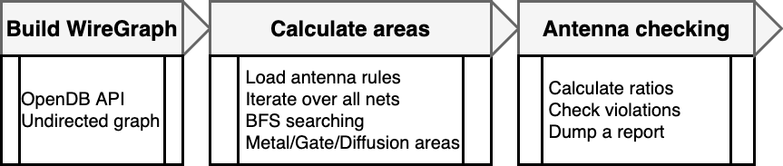
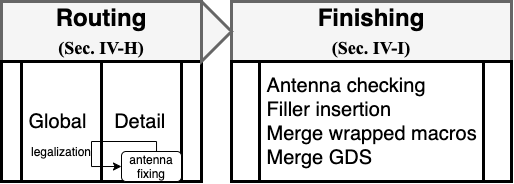

[:arrow_backward: &nbsp; Previous: Generating Reports](../4_generating_reports) &nbsp;&nbsp;&nbsp;&nbsp;|&nbsp;&nbsp;&nbsp;&nbsp;        [Next: Layout Visualization &nbsp; :arrow_forward:](../6_layout_visualization)

# Antenna Fix Example

Contributed by: [Mehdi Saligane](https://github.com/msaligane)


In this section, we will build an antenna checker completely in `Tcl`.



The flow starts with using OpenDB API to build a WireGraph instance, wiregraph is an undirected graph, the nodes in a wiregraph represent points on a metal wire, the edges represent connections in the wire(VIAs, METALs). After the wiregraph is generated, load_antenna_rules method is called to load all layers' antenna factors into ARC, the metal/gate/diffusion areas of each layer and input/ouput gate are calculated by applying BSF to the generated wiregraph. Then antenna ratios are calculated using the areas from the last step and a checking function is run by comparing the ratios calculated and the boundary ratios specified in LEF. This is followed by the last step to write a detail report which shows the PAR/CAR values of each gate and if antenna violations exist there.


### Load Antenna Rules

The following method calculates each layer's antenna factors through OpenDB APIs, the data is stored for future use in the checking process.

```Tcl
proc load_antenna_rules { } {
  antenna_checker::load_antenna_rules
}
```

### Check Antennas

The following method loads antenna rules, and then starts the antenna checking process, the output is written into a "antenna.rpt" file under the path specified.

```Tcl
proc check_antennas { args } {
  sta::parse_key_args "check_antennas" args \
  keys {-path} \
  flags {}

  antenna_checker::antennachecker_set_verbose [info exists flags(-verbose)]
  antenna_checker::load_antenna_rules
  antenna_checker::check_antennas $keys(-path)
}
```

### Get available metal length

The following method calculates the length of the metal that can be added to a current metal layer, the PAR ratios are kept satisfied.

```Tcl
proc get_met_avail_length { args } {
  sta::parse_key_args "get_met_rest_length" args \
    keys {-net_name -route_level} \
    flags {}

  if { [info exists keys(-net_name)] } {
    set netname $keys(-net_name)
    antenna_checker::antennachecker_set_net_name $netname

    if { [info exists keys(-route_level)] } {
      set rt_lv $keys(-route_level)
      sta::check_positive_integer "-route_level" $rt_lv
      antenna_checker::antennachecker_set_route_level $rt_lv
    } else {
      ord::error "no -route_level specified."
    }
  } else {
    ord::error "no -net_name specified."
  }
  antenna_checker::get_met_avail_length
}
```

### Check Net Violations

The following method reads a net name, then the function antenna_checker::check_net_violation checks if the target net has antenna violations, the function returns 1 if it is true, otherwise return 0

```Tcl
proc check_net_violation { args } {
  sta::parse_key_args "check_net_violation" args \
  keys {-net_name} \
  flags {}

  if { [info exists keys(-net_name)] } {
    set netname $keys(-net_name)
    set res [antenna_checker::check_net_violation $netname]
    
    return $res
  } else {
    ord::error "no -net_name specified."
  }  
  
  return 0
}
```

### Add Antenna Cell

The following method will add a diode to the target iterm of the instance specified, the diode is placed but is not routed, the process requires later legalization of placement.

```Tcl
proc add_antenna_cell { net antenna_cell_name sink_inst antenna_inst_name } {

  set block [[[::ord::get_db] getChip] getBlock]
  set net_name [$net getName]

  set antenna_master [[::ord::get_db] findMaster $antenna_cell_name]
  set antenna_mterm [$antenna_master getMTerms]

  set inst_loc_x [lindex [$sink_inst getLocation] 0]
  set inst_loc_y [lindex [$sink_inst getLocation] 1]
  set inst_ori [$sink_inst getOrient]

  set antenna_inst [odb::dbInst_create $block $antenna_master $antenna_inst_name]
  set antenna_iterm [$antenna_inst findITerm "A"]

  $antenna_inst setLocation $inst_loc_x $inst_loc_y
  $antenna_inst setOrient $inst_ori
  $antenna_inst setPlacementStatus PLACED
  odb::dbITerm_connect $antenna_iterm $net

}
```

### Antenna Fixing

The following method removes all fillers in the OpenDB, then it traverses all nets to check antenna violation. If a violation is detected, add_antenna_cell method is called to add diodes to the target instance. The antenna cell name `antenna_cell_name` and the output file name `target_file` need be set in advance.



This figure shows where the antenna fixing code is used to add antenna diodes.

```Tcl
proc antenna_fixing {} {

  set block [[[::ord::get_db] getChip] getBlock]
  
  foreach inst [$block getInsts] {
    if {[[$inst getMaster] getType] == "CORE_SPACER"} {
      odb::dbInst_destroy $inst
    }
  }
  
  set antenna_cell_name "ANTENNA3"
  
  set target_file "final_with_diodes"
  
  set antenna_node_counts 0
  
  foreach net [$block getNets] {
    set net_name [$net getConstName]
    set flag [check_net_violation -net_name $net_name]
    if {$flag == 0} {
      continue
    }
  
    if { [$net isSpecial] } {
      continue
    }
  
    foreach iterm [$net getITerms] {
      set inst [$iterm getInst]
  
      set antenna_inst_name "ANTENNA"
      append antenna_inst_name "_" [$inst getName]
  
      if {[catch {add_antenna_cell $net $antenna_cell_name $inst $antenna_inst_name} result] } {
        puts "adding diode failed"
        continue
      } else {
        set antenna_node_counts [expr $antenna_node_counts + 1]
      }
  
      break
  
    }
  }
  
  set verilog_file_name "$target_file.v"
  write_verilog  $verilog_file_name
  
  set def_file_name "$target_file.def"
  write_def $def_file_name

}
```

### Putting It All Together

```Tcl
read_lef "data/merged_spacing.lef"
read_def -order_wires "data/sw130_random.def"

# load layers' antenna rules into ARC
load_antenna_rules

# start checking antennas and generate a detail report
check_antennas -path ./

# calculate the available length that can be added to net54, at route level 1, while keeping the PAR ratios satisfied
get_met_avail_length -net_name "net51" -route_level 1

# check if net52 has a violation
set vio [check_net_violation -net_name "net50"]
puts "this net has violation: $vio"

antenna_fixing
```

## Conclusion
In this part, we have used OpenROAD `Tcl` interface to build an Antenna Checker and Fixer. This shows how far you can go with the tool using only its `Tcl` interface.

In the next section, we will give a brief overview on using KLayout for visualization.

[:arrow_backward: &nbsp; Previous: Generating Reports](../4_generating_reports) &nbsp;&nbsp;&nbsp;&nbsp;|&nbsp;&nbsp;&nbsp;&nbsp;        [Next: Layout Visualization &nbsp; :arrow_forward:](../6_layout_visualization)
