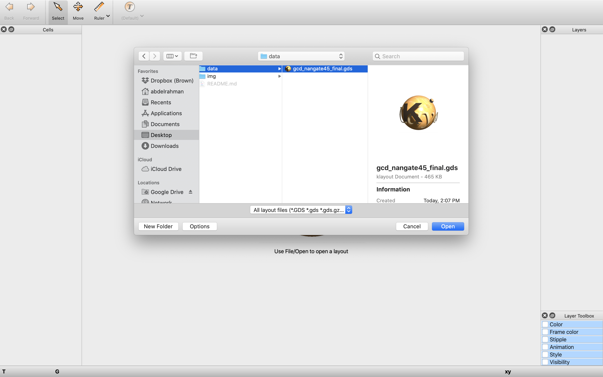

[:arrow_backward: Previous: Antenna Fix Example](../5_antenna_fix_example) &nbsp;&nbsp;&nbsp;&nbsp;|&nbsp;&nbsp;&nbsp;&nbsp;        [Next: OpenDB Python API :arrow_forward:](../6_visualizing_using_klayout)

# Layout Visualization

## KLayout

In this section, we will use KLayout to visualize OpenROAD flow result.

> :warning: **NOTE** :warning: 
> OpenROAD is not affiliated with the KLayout project. 
KLayout is an open-source project released at https://github.com/KLayout/klayout under GNU General Public License.

### Installation

You can install KLayout from https://www.klayout.de/build.html

### How to Visualize

We will use the flow result generated from the [RTL to GDS Autonomous Flow](../3_rtl_to_gds_autonomous_flow) section. We have copied the results under the [data](data/) directory in this section.

#### Open KLayout
The landing screen of KLayout looks like the one below.

#### Open GDS File

From the *File* menu, select *Open*.

Choose the GDS file under the [data](data) directory and click *open*.

The layout of the final design can be viewed in the main canvas.

On the right-hand side, there are controls to hide/show specific layers. Use your mouse to zoom in and out.

## EDA Viewer

In this section, we will use EDA Viewer to visualize OpenROAD flow result.

> :warning: **NOTE** :warning: 
> Although EDA Viewer uses OpenDB infrastructure, OpenROAD is not affiliated with the EDA Viewer project. EDA Viewer is an open-source project released at https://github.com/ahmed-agiza/EDAViewer under MIT license.

**Access:** https://edaviewer.com

EDA Viewer is a rising project that uses [OpenDB](https://github.com/The-OpenROAD-Project/OpenDB) infrastructure is [EDA Viewer](https://edaviewer.com/). It's released at https://github.com/ahmed-agiza/EDAViewer under MIT license and is completely web-based (requires no installation). 

EDA Viewer uses a [Golang](https://golang.org/) binding to [OpenDB](https://github.com/The-OpenROAD-Project/OpenDB) and draws the layout using [WebGL](https://get.webgl.org/) (high performance rendering). There are instructions to run the tool on a local machine.

In a web browser, go to https://edaviewer.com and load the LEF/DEF file from the flow results. Here is how the layout visualized in the browser looks like.

## Conclusion

In this section, we have presented free open-source options to visualize the layout resulted from OpenROAD project. 

[:arrow_backward: Previous: Antenna Fix Example](../5_antenna_fix_example) &nbsp;&nbsp;&nbsp;&nbsp;|&nbsp;&nbsp;&nbsp;&nbsp;        [Next: OpenDB Python API :arrow_forward:](../6_visualizing_using_klayout)