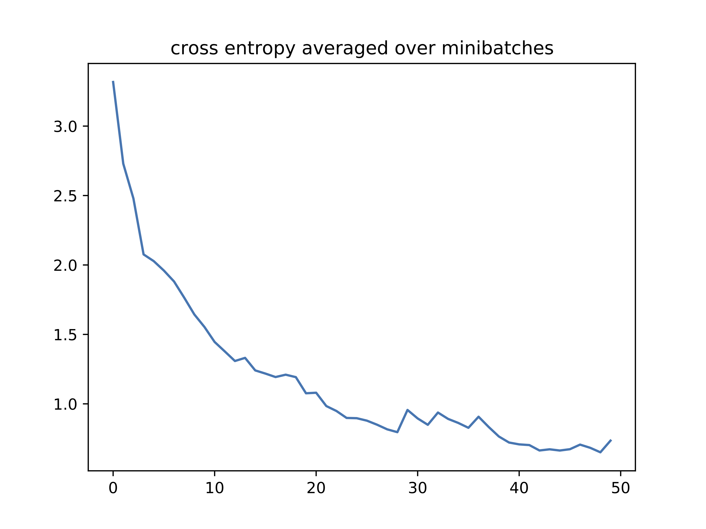

[:arrow_backward: &nbsp; Previous: OpenDB Python API](../7_opendb_python_api) &nbsp;&nbsp;&nbsp;&nbsp;|&nbsp;&nbsp;&nbsp;&nbsp;        [Next: Adding A Tool to OpenROAD &nbsp; :arrow_forward:](../9_adding_a_tool_example)

# Machine Learning Example

In this example, we will use a Graph Convolutional network to train a neural network classifier for netlists.

## Dataset

The dataset is generated by synthesizing some designs using different optimizations yielding different graphs that basically represent the same netlist. We use `read_netlist.py` from the [previous example](../7_opendb_python_api/data/read_netlist.py) and save all netlists to a file.

For this tutorial, we have generated the dataset for you in [dac20-ml-example.zip](data/dac20-ml-example.zip). The dataset contains 160 graphs that represent 8 designs. Each design has 20 representative netlists, and the design name is used as its class label.

## Prepare Your Virtualenv

Let's create a virtualenv to install Python packages.

```Shell
cd code
virtualenv .venv
source .venv/bin/activate
pip install -r requirements.txt
```

## Model Training

The code is divided into three files:

* [code/dataset.py](code/dataset.py): prepares the netlists into a compatible dataset.
* [code/model.py](code/model.py): contains the definition of the GCN and classifier models.
* [code/main.py](code/main.py): runs the model and saves the results

#### Run the training

`python main.py dac20-ml-example output`

#### Training Loss

Epochs: 50



#### Classification Accuracy on Test Set

* **Accuracy of sampled predictions:** `62.50%`
* **Accuracy of argmax predictions:** `75.00%`

## Conclusion

This example capitalizes on OpenDB capabilities and show how straightforward it is to start building ML models on OpenDB. There are many enhancements that can (and should) be done in the model. Feel free to fork the code and use it in your project. Please, keep the license header.

[:arrow_backward: &nbsp; Previous: OpenDB Python API](../7_opendb_python_api) &nbsp;&nbsp;&nbsp;&nbsp;|&nbsp;&nbsp;&nbsp;&nbsp;        [Next: Adding A Tool to OpenROAD &nbsp; :arrow_forward:](../9_adding_a_tool_example)